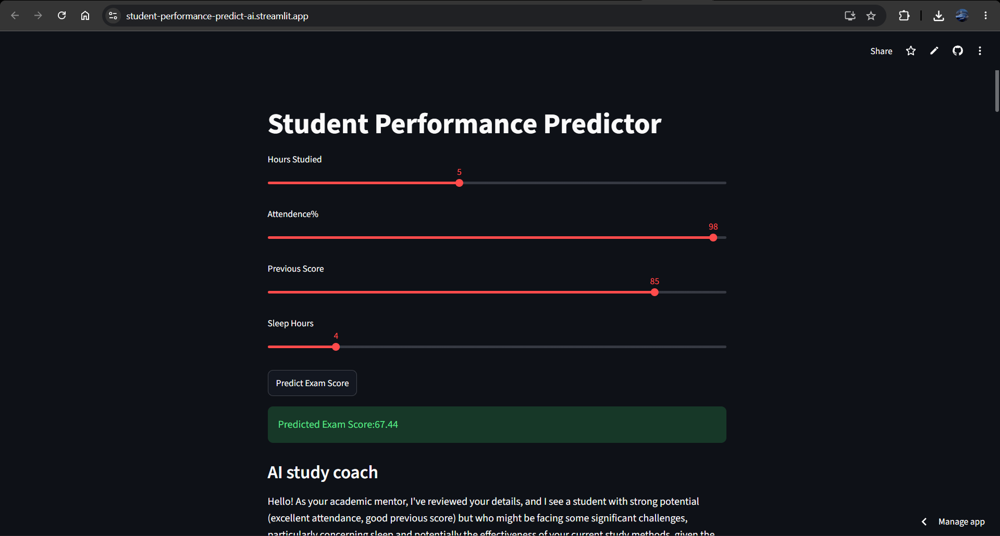

# Student Performance Predictor with AI Study Coach

[](https://student-performance-predict-ai.streamlit.app/)



## Overview

This project predicts student exam performance using Machine Learning and provides personalized study recommendations using Google's Gemini AI.

The system analyzes student study habits and academic factors to estimate exam scores and generate customized improvement plans.

## Features

* Predict student exam scores using Random Forest Regression
* Handle missing values and preprocess educational data
* Perform exploratory data analysis (EDA)
* Hyperparameter tuning using GridSearchCV
* Cross-validation for model evaluation
* Save trained model using Joblib
* Generate AI-powered study recommendations using Gemini
* Interactive Streamlit web application
* Personalized study schedules and exam preparation tips

## Dataset

**Dataset:** StudentPerformanceFactors.csv

### Input Features

* Hours Studied
* Attendance
* Previous Scores
* Sleep Hours

### Target Variable

* Exam Score

## Technologies Used

* Python
* Pandas
* NumPy
* Matplotlib
* Seaborn
* Scikit-Learn
* Streamlit
* Google Gemini API
* Joblib

## Machine Learning Workflow

1. Data Loading
2. Data Cleaning
3. Missing Value Handling
4. Label Encoding
5. Exploratory Data Analysis
6. Feature Selection
7. Model Training
8. Hyperparameter Tuning
9. Model Evaluation
10. Model Deployment

## Model Used

### Random Forest Regressor

The project uses Random Forest Regression to predict exam scores based on student academic factors.

### Evaluation Metrics

* R² Score
* Cross Validation Score

## Installation

```bash
git clone https://github.com/yourusername/student-performance-predictor-ai.git

cd student-performance-predictor-ai

pip install -r requirements.txt
```

## Run the Project

### Training

```bash
python studentperformancefactors.py
```

### Streamlit Application

```bash
streamlit run app.py
```

## Sample Prediction

Input:

* Hours Studied: 5
* Attendance: 75%
* Previous Score: 65
* Sleep Hours: 6

Output:

* Predicted Exam Score
* AI Generated Study Plan
* Daily Study Schedule
* Revision Strategy
* Exam Preparation Advice

## Future Improvements

* Include all dataset features
* Compare multiple regression models
* Feature importance visualization
* Model explainability using SHAP
* Deployment on Streamlit Cloud
* Student performance dashboard

## Author

Abhinav Krishna C S

## License

This project is for educational and academic purposes.
